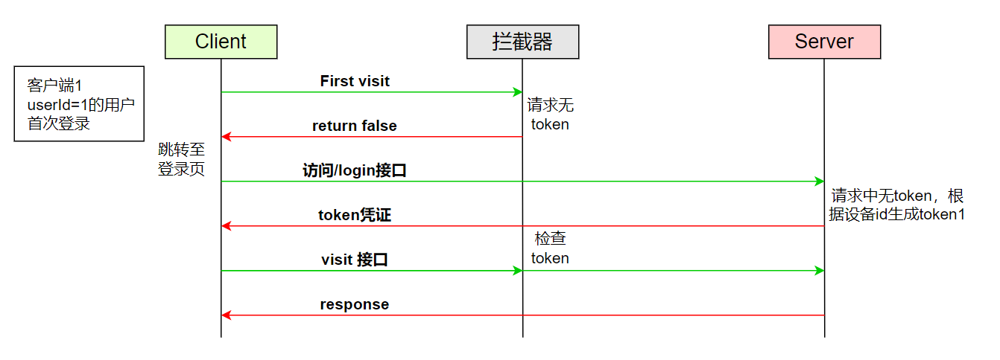
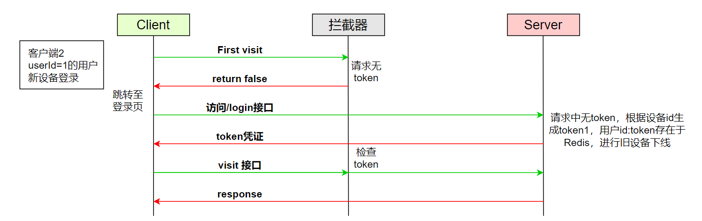
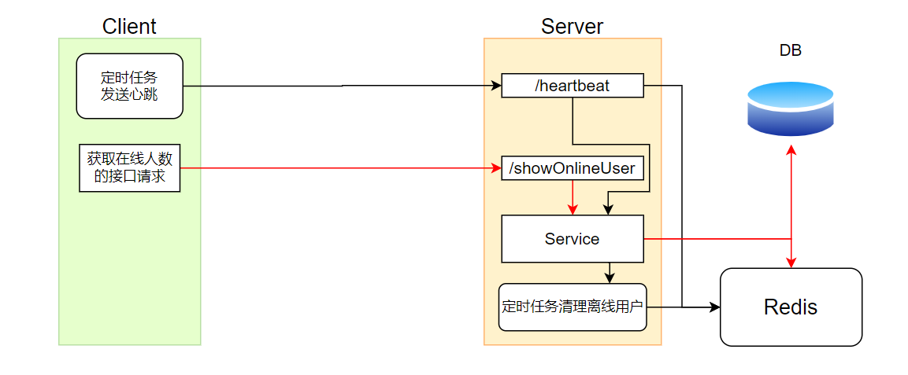
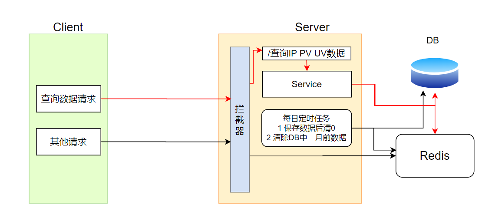
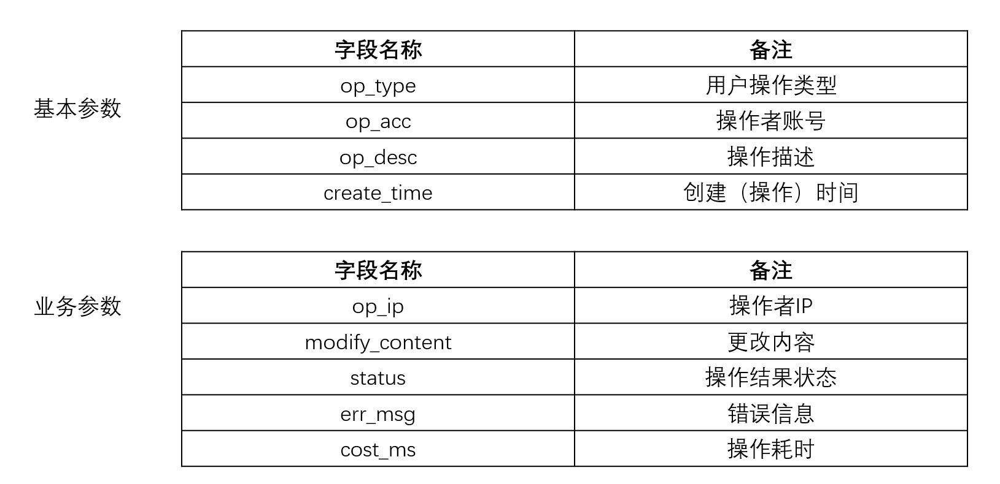
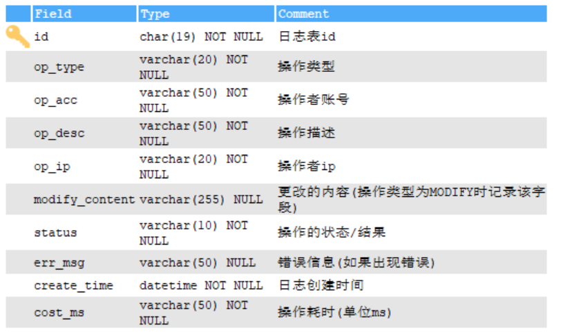

# 从0到1Demo项目实现文档

[TOC]

------

## 写在前面

项目采用前后端分离架构，本文档主要记录后端的编码设计与部分实现。

## 全局配置

### 统一返回结果

设置Result类，用于统一后端接口返回给前端的数据格式，Result类包含操作状态、状态码、结果信息、数据。

```java
@Data
public class Result {
    private Boolean isSuccess;
    private Integer code;
    private String message;
    private Map<String, Object> data = new HashMap<>();

    public Result() {}

    /***
     * @return 返回操作成功的Result对象
     */
    public static Result ok() {
        Result result = new Result();
        result.setIsSuccess(true);
        result.setCode(ResultCode.SUCCESS);
        result.setMessage("成功");
        return result;
    }

    /***
     * @return 返回操作失败的Result对象
     */
    public static Result error() {
        Result result = new Result();
        result.setIsSuccess(false);
        result.setCode(ResultCode.ERROR);
        result.setMessage("失败");
        return result;
    }

    public Result setMessage(String message) {
        this.message = message;
        return this;
    }

    public Result setCode(Integer code) {
        this.code = code;
        return this;
    }

    /***
     * 将Result对象中的默认map替换为新的data
     * @param data 新的data
     * @return Result对象实例
     */
    public Result data(Map<String, Object> data) {
        this.setData(data);
        return this;
    }

    /***
     * 向结果对象中以 k-v 的方式加入数据
     * @param key key
     * @param value value
     * @return Result对象
     */
    public Result data(String key, Object value) {
        this.data.put(key, value);
        return this;
    }
}
```

对应结果操作码code，需要创建状态码常量，前端对后端返回的状态码做相应的处理。开局先设置两个状态码，后面随着业务增加再增加其余状态码。

```java
public interface ResultCode {
    /***
     * 成功码 20000
     */
    Integer SUCCESS = 20000;

    /***
     * 异常码 10000
     */
    Integer ERROR = 10000;
}
```


### 自定义异常

自定义异常在本项目中主要用于在某些地方抛出，经由全局异常处理器将异常结果返回给前端处理。自定义异常继承RuntimeException类并重写其中的方法即可。

```java
public class CustomException extends RuntimeException {
    private Integer errorCode;
    private String errorMsg;

    //省略...
}
```


### 统一异常处理

全局异常处理器用于捕获项目在运行过程中出现的异常，并按照处理器配置做相应处理。全局异常处理器需在类上使用@ControllerAdvice注解标识，类中处理相应异常的方法使用@ExceptionHandler(类.class)标识。

```java
@ControllerAdvice
@Slf4j
public class GlobalExceptionHandler {

    /***
     * 处理自定义异常
     * @param customException 自定义异常
     * @return Result结果对象
     */
    @ExceptionHandler(CustomException.class)
    @ResponseBody
    public Result customExceptionHandle(CustomException customException) {
        customException.printStackTrace();
        log.error(customException.getErrorMsg());
        return Result.error()
                .setMessage(customException.getMessage())
                .setCode(customException.getErrorCode());
    }
}
```


### Swagger2配置

主要配置接口测试文档，需要引入swagger2依赖

```yml
<!--swagger-->
<dependency>
	<groupId>io.springfox</groupId>
    <artifactId>springfox-swagger2</artifactId>
    <version>2.7.0</version>
</dependency>
<dependency>
    <groupId>io.springfox</groupId>
    <artifactId>springfox-swagger-ui</artifactId>
    <version>2.7.0</version>
</dependency>
```


### Redis配置

首先引入Redis依赖，在yml文件中配置相关连接信息，如若需要则再创建配置类注入RedisTemplate对象到Bean容器中。

```yml
<dependency>
    <groupId>org.springframework.boot</groupId>
    <artifactId>spring-boot-starter-data-redis</artifactId>
</dependency>
```


### MyBatis-Plus代码生成器配置

代码生成器可以免去手动创建controller、service、mapper、entity等重复操作。运行代码生成器前需要先创建好对应的数据库表。

```java
public class GenerateCoder {

    @Test
    public void generate() {
        // 1、创建代码生成器
        AutoGenerator mpg = new AutoGenerator();

        // 2、全局配置
        GlobalConfig gc = new GlobalConfig();
        String projectPath = System.getProperty("user.dir");
        //生成的代码所在的全路径
        gc.setOutputDir("D:\\Program Files (x86)\\...xxx" + "/src/main/java");
        gc.setAuthor("");
        gc.setOpen(false); //生成后是否打开资源管理器
        gc.setFileOverride(false); //重新生成时文件是否覆盖
        gc.setServiceName("%sService");    //去掉Service接口的首字母I
        gc.setIdType(IdType.ID_WORKER_STR); //主键策略
        gc.setDateType(DateType.ONLY_DATE);//定义生成的实体类中日期类型
        gc.setSwagger2(true);//开启Swagger2模式

        mpg.setGlobalConfig(gc);

        // 3、数据源配置
        DataSourceConfig dsc = new DataSourceConfig();
        dsc.setUrl("jdbc:mysql://localhost:3306/数据库名称?serverTimezone=GMT%2B8");
        dsc.setDriverName("com.mysql.cj.jdbc.Driver");
        dsc.setUsername("");
        dsc.setPassword("");
        dsc.setDbType(DbType.MYSQL);
        mpg.setDataSource(dsc);

        // 4、包配置
        PackageConfig pc = new PackageConfig();
        pc.setModuleName(""); //模块名 多模块时可用
        pc.setParent("com.example.fromzerotoexpert");
        pc.setController("controller");
        pc.setEntity("entity");
        pc.setService("service");
        pc.setMapper("mapper");
        mpg.setPackageInfo(pc);

        // 5、策略配置
        StrategyConfig strategy = new StrategyConfig();
        strategy.setInclude("表名");//表
        strategy.setNaming(NamingStrategy.underline_to_camel);//数据库表映射到实体的命名策略
        strategy.setTablePrefix(pc.getModuleName() + "_"); //生成实体时去掉表前缀
        strategy.setColumnNaming(NamingStrategy.underline_to_camel);//数据库表字段映射到实体的命名策略
        strategy.setEntityLombokModel(true); // lombok 模型 @Accessors(chain = true) setter链式操作
        strategy.setRestControllerStyle(true); //restful api风格控制器
        strategy.setControllerMappingHyphenStyle(true); //url中驼峰转连字符

        mpg.setStrategy(strategy);

        // 6、执行
        mpg.execute();
    }
}
```


### 日期自动注入

实体类对象的日期等字段在创建或更新时可以不必手动赋值，使用自动注入功能去赋值。在需要自动注入日期的实体类中的对应字段使用@TableField注解标识，@TableField(fill = FieldFill.INSERT)代表在插入数据（对象）到数据库表中时为相应字段赋值，@TableField(fill = FieldFill.INSERT_UPDATE)代表在插入、更新对应数据库表的记录时为该字段赋值。

```java
@Data
class User {
	//只列出了两个日期相关的字段
    @TableField(fill = FieldFill.INSERT)
    private Date gmtCreate;

    @TableField(fill = FieldFill.INSERT_UPDATE)
    private Date gmtModified;
}
```

除此之外还需创建一个实现MetaObjectHandler接口的MyMetaObjectHandler实现类，配置需要自动赋值的字段。	

```java
@Component
public class MyMetaObjectHandler implements MetaObjectHandler {
    //配置往数据库表中插入数据时需要自动赋值的字段
    @Override
    public void insertFill(MetaObject metaObject) {
        this.setFieldValByName("gmtCreate", new Date(), metaObject)
                .setFieldValByName("gmtModified", new Date(), metaObject)
                .setFieldValByName("createTime", new Date(), metaObject);
    }
	//配置往数据库表中更新数据时需要自动赋值的字段
    @Override
    public void updateFill(MetaObject metaObject) {
        this.setFieldValByName("gmtModified", new Date(), metaObject);
    }
}
```

### 拦截器注册

```java
@Configuration
public class WebConfigurer implements WebMvcConfigurer {

    @Autowired
    private GlobalInterceptor globalInterceptor;

    /***
     * 用于注册拦截器
     * @param registry registry
     */
    @Override
    public void addInterceptors(InterceptorRegistry registry) {
        registry.addInterceptor(globalInterceptor)
                .addPathPatterns("/**")
                .excludePathPatterns("/VerifyCode/**")
                .excludePathPatterns("/RSA-Encryption/**")
                .excludePathPatterns("/RegisterAndLogin/**")
                .excludePathPatterns("/swagger-ui.html/**")
                .excludePathPatterns("/webjars/springfox-swagger-ui/**")
                .excludePathPatterns("/swagger-resources/**");
    }

    /***
     * 配置静态资源
     * @param registry registry
     */
    @Override
    public void addResourceHandlers(ResourceHandlerRegistry registry) {

    }
}
```


## 登录注册模块

对于登录注册中需要涉及的密码、手机号等敏感数据，项目中使用了RSA加解密，同时注册功能增加手机验证码的验证，登录功能使用 Token 作为登录凭证，这里使用 Jwt 。用户登录密码在服务端采用MD5加密后存入数据库，目前支持单设备登录限制。同时使用前缀树实现用户敏感词检测过滤（该功能在本项目中应该在前端实现更为合理且方便）。

### RSA

RSA为非对称加密算法，数据接收端持有公钥私钥，数据发送方只持有公钥，发送方发送数据时，使用公钥对数据进行加密，接收端收到数据使用私钥进行解密得到原始数据。

服务端调用 RSA 工具类时，先查看是否已有公钥私钥文件，有则将公钥私钥文件读取并初始化公钥私钥对象供加解密使用；若没有则生成公钥私钥对象并将对应的公钥私钥字符串以文件的显示写入本地供使用。

### 手机验证码

采用阿里云短信服务，具体参考 [阿里云平台](https://www.aliyun.com/) 搜索短信服务，进入控制台，再在快速学习中根据指引与文档整合短信服务。

### 注册

- 验证码参数与Redis中保存的验证码（phone : verifyCode）校验

- 生成用户账号，BCrypt随机盐编码密码，存入数据库

### 登录

#### 首次登录



- 访问Login/Register等拦截器不拦截的请求时，无需检查token
- 根据用户id与从request中获取到的设备标识生成token（JWT）返回至客户端
- 将id、token信息存至Redis（id : token）并设置过期时间

#### 单设备在线限制



项目中使用token来区分不同的设备，token可以根据设备id或者系统时间戳来生成，若用户在原设备上访问站点，携带的token都是原设备或原先的时间戳相关。同一个账号在新设备登录前是**无token凭证**的，需要进行登录操作获取，如果在 **无token凭证** 的情况下，Redis中却能根据用户id查询到token，说明此账号还在旧设备上登录着，那么新设备登录就需要将旧设备踢下线，即将Redis中旧的（id : token）删除即可，当旧设备继续发送需要经过拦截器的请求时会检查token凭证是否合法且未过期，或是id在Redis中可查询到token但请求中携带的token与之不同，那么拦截器会将请求拦截下来。

## 数据统计与拦截

### 统计网站用户在线人数



项目实现中暂时无法做到非常实时的在线人数统计。大概实现思路：前端创建定时任务定时请求后端接口（/heartbeat）作为一种心跳机制，后端每接收到一次心跳则更新/新增Redis中心跳的时间戳，同时在后端创建定时异步任务定时清理离线用户（淘汰掉Redis中超过规定时间的k-v）。

- 收到心跳更新Redis中（id:timestamp）的时间戳
- 定时清理Redis中离线用户

### 统计网站每日访问的IP、PV、UV



网站的IP 、PV、UV的统计在拦截器中实现，将统计得到的数据存入Redis中，每日对这三个数据写入数据库中并在Redis中清 0，每天定时清除一个月前数据库中的IP、PV、UV。

- IP 为独立ip地址的访问次数，使用HyperLogLog统计：**key**-'website:ip' : **value**-'次数'
- UV 为一个用户在一个页面的重复访问为**一次**访问，使用HyperLogLog统计：**key**-'website:uv' : **value**-'次数'
- PV 为独立页面访问次数，以'website:pv'为key直接存入String进行常规计数
- 每日更新IP、PV、UV数据：使用定时异步任务
- 每日定时清除一个月前数据库中的IP、PV、UV：设置定时任务


### 防止用户恶意刷屏

更为理想的实现方式是计算同一个ip用户几次请求的请求频率，频率过高则判定为恶意刷屏。但本项目是在拦截器中，统计在一定时间范围内一个ip请求的次数，如果超过限制次数则判定为刷屏。一个ip第一次访问时将其存入Redis缓存中，以（k-ip+接口 ：v-count）的格式，并设置过期时间如1min，同一个ip再次访问网站时会将Redis中的（k-ip+接口  v-count）加一，在拦截器中判定是否刷屏。这里还设置IP白名单功能，提供接口增加ip白名单及删除ip白名单，在拦截器判断刷屏时，如ip在白名单内则不进行刷屏判断，在项目中是将白名单简单存储在Redis中，更好的应当存储在数据库表中。


## 日志系统

日志系统用于对用户对于接口的调用操作进行记录。本项目日志系统使用自定义注解+AOP实现无侵入式日志记录。使用自定义注解标识在需要进行日志记录的方法上，同时向注解传入参数，在增强方法中获取对应参数，结合其他内容创建日志对象，为不增加业务流程的等待时间，对象存入数据库采用自定义线程池创建多线程任务实现。

### 日志数据库表设计

日志表字段总体分为两大部分：基本参数、业务参数。



创建明细如下：


### 日志操作类型枚举

用于在自定义注解中指定用户的调用某一个接口的操作行为。

```java
public interface OperateType {
    String LOGIN = "Login";
    String LOGOUT = "Logout";
    String REGISTER = "Register";
    String ADD = "Add";
    String DELETE = "Delete";
    String MODIFY = "Modify";
    String READ = "Read";
    String OTHER = "Other";
}
```


### 自定义日志注解

为达到无侵入记录日志，使用自定义注解，自定义注解创建如下：

```java
@Target(ElementType.METHOD)//标识该注解用在 方法 上
@Retention(RetentionPolicy.RUNTIME)//标识该注解在运行期间一直有效
public @interface LogRecord {
    //操作类型
    String operateType() default "";
    //操作描述
    String operateDesc() default "";
    //更新的新内容的表的id(操作类型为MODIFY时记录)
    String contentId() default "";
}
```

使用方式如下：

```java
@CrossOrigin
@RestController
@RequestMapping("/RegisterAndLogin")
public class RegisterLoginController {

    @ApiOperation("用户退出登录")
    @GetMapping("logout")
    @LogRecord(operateType = OperateType.LOGOUT, operateDesc = "用户退出登录")
    public Result doLogout(
            @RequestParam(value = "id", defaultValue = "")
            @NotNull @ApiParam("用户id") String id
    ) {
        int res = userService.userLogout(id);
        return res == 1 ? Result.ok() : Result.error();
    }
}
```

因为对于更新（操作类型为Modify）操作需要记录用户操作前后的数据变化，这里暂时没实现，因此`modify_content`字段暂时不会使用到。


### 自定义线程池

使用多线程是为了减少日志记录对业务的影响，那么使用多线程最好的就是使用自定义线程池，若不考虑大并发等可以使用默认线程池的，自定义线程池可以指定线程池详细参数来控制整个过程的性能，其中`workqueue`参数这里参考 [Java线程池实现原理及在美团业务中的实践](https://mp.weixin.qq.com/s?__biz=MjM5NjQ5MTI5OA==&mid=2651751537&idx=1&sn=c50a434302cc06797828782970da190e&chksm=bd125d3c8a65d42aaf58999c89b6a4749f092441335f3c96067d2d361b9af69ad4ff1b73504c&scene=21#wechat_redirect) 使用自定义`LinkedBlockingQueue`，实际上就是将JDK的`LinkedBlockingQueue`改个名字并将其中 `capacity` 属性删去final关键字，让它变成一个长度可变的队列，后期可以通过修改 `corePoolSize`、`maximumPoolSize`、`workQueue`来控制线程池。

```java
@Data
@Configuration
public class ExecutorConfig {

    //核心线程数
    private static int corePoolSize = 10;
    //最大线程数
    private static int maximumPoolSize = 10;
    //存活时间
    private static long keepAliveTime = 5;
    //单位
    private static final TimeUnit unit =TimeUnit.MINUTES;
    //队列长度
    private static final int queueSize = 10;

    //获取自定义线程池
    @Bean("LogThreadPool")
    public ThreadPoolExecutor buildThreadPoolExcutor() {
        return new ThreadPoolExecutor(corePoolSize,
                maximumPoolSize,
                keepAliveTime,
                unit,
                new ResizableLinkedBlockingQueue<>(10),
                new CustomThreadFactory("LogThreadPool"));
    }
}
```


### AOP实现用户日志记录

使用AOP先引入AOP的依赖，创建切面类，编写切入点、增强方法等。

```java
@Slf4j
@Aspect
@Component
public class LogAspect {

    @Resource
    private UserService userService;

    @Resource
    private RecordLogService logService;

    @Autowired
    private ThreadPoolExecutor executor;

    /**
     * 切入点
     */
    @Pointcut("@annotation(com.example.fromzerotoexpert.annotation.LogRecord)")
    public void logRecord() {
    }

    /***
     * 增强(通知)
     * @param joinPoint 连接点
     * @return 原被增强方法的执行结果
     */
    @Around("logRecord()")
    public Result aroundEnhance(ProceedingJoinPoint joinPoint) {
    	//省略...
        //将日志记录 异步 刷盘
        executor.submit(() -> logService.save(recordLog));
    }
}
```


### 多条件组合分页查询日志

#### 创建查询对象LogQuery

```java
@Data
@ApiModel
public class LogQuery {
    @ApiModelProperty(value = "操作类型")
    private String opType;

    @ApiModelProperty(value = "操作者账号")
    private String opAcc;

    @ApiModelProperty(value = "操作的状态/结果")
    private String status;

    @ApiModelProperty(value = "起始时间", example = "2019-01-01 10:10:10")
    private Date beginTime;

    @ApiModelProperty(value = "结束时间", example = "2019-01-01 10:10:10")
    private Date endTime;
}
```

前端发送查询对象至后端，后端根据查询对象拼接查询条件，到数据库中查询，再将结果封装返回。


## 系统故障排查与监控

这里的系统故障排查于监控指对服务器，项目中对MySQL以及Redis进行监控，若发现MySQL或Redis挂掉，则进行重启并记录日志。

具体：编写shell脚本，使用 ps、grep 命令获取当前MySQL、Redis 的状态，若挂掉则重启，并将时间及信息重定向至服务器文件中。

- 编写Shell脚本监控
- 使用cron定时任务定时执行脚本

shell脚本如下：

```shell
#读取当前MySQL redis状态
STATUS_MySQL=$(ps -ef | grep mysqld | grep -v grep | wc -l)
STATUS_Redis=$(ps -ef | grep "redis-server" | grep -v grep | wc -l)

#MySQL重启
if [ $STATUS_MySQL -eq 0 ];then
        echo "$(date):MySQL已停止运行，自动重启" >> /usr/local/projectlog/onetoexpert/check_wrong_MySQL.log
        systemctl start mysqld
        echo "MySQL重启-"$?
else
        echo "MySQL运行正常"
fi

#redis重启
if [ $STATUS_Redis -eq 0 ];then
        echo "$(date):Redis已停止运行，自动重启" >> /usr/local/projectlog/onetoexpert/check_wrong_Redis.log
        systemctl start redis
        echo "Redis重启-"$?
else
        echo "Redis运行正常"
fi
```

